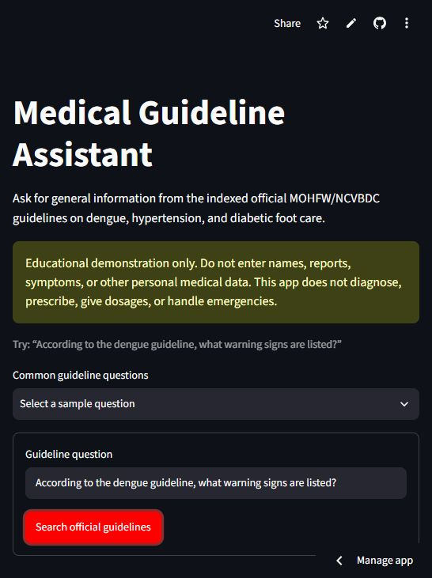
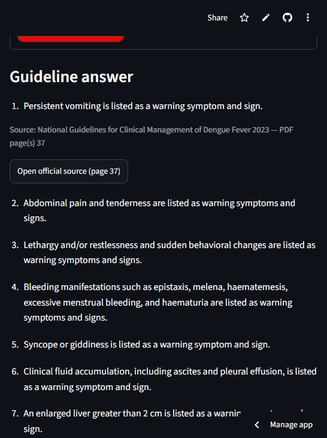

# Medical Guideline Assistant

[](https://medical-guideline-assistant-luowhfprn5urrtnhgrgzq7.streamlit.app/)


> 🩺 **Trusted guidelines in. Grounded answers out.**

An educational retrieval-augmented generation (RAG) application that answers
general questions using a curated collection of official Indian government
medical guidelines. The application retrieves evidence before generation,
validates every citation, and refuses personalized diagnosis, treatment, dosage,
patient-data interpretation, and emergency requests.

> **Safety notice:** This is a course project, not a medical device. It provides
> information from indexed official guidelines only and does not provide
> personalized medical advice. Do not submit names, medical records, symptoms, or
> other personal health information.

## 🚀 Live demo

[Open the Medical Guideline Assistant on Streamlit Community Cloud](https://medical-guideline-assistant-luowhfprn5urrtnhgrgzq7.streamlit.app/)

## 📸 Working application

The deployed interface includes ready-made questions, a free-text guideline
question field, and an educational-use safety notice.



Answers are grounded in retrieved guideline passages and include the official
source, exact PDF page, and a direct link to the government document.



## 🎯 Project goal

The project demonstrates how to:

- build a reproducible corpus from allowlisted government PDF URLs;
- combine BM25 keyword retrieval with Gemini semantic embeddings;
- constrain Gemini to retrieved evidence and structured JSON;
- resolve citations from trusted application metadata rather than model text;
- refuse unsafe or insufficiently supported requests; and
- evaluate retrieval quality and safety behavior.

## 📚 Indexed topics

The current corpus contains 443 audited chunks from three public guidelines:

1. **National Guidelines for Clinical Management of Dengue Fever 2023** —
   NCVBDC/MOHFW.
2. **Screening, Diagnosis, Assessment, and Management of Primary Hypertension in
   Adults in India** — MOHFW.
3. **The Diabetic Foot: Prevention and Management in India (Draft)** — MOHFW.

Source URLs, document dates, page inclusion rules, and filenames are maintained in
[`configs/sources.json`](configs/sources.json). The downloader accepts HTTPS URLs
only from explicitly approved MOHFW/NCVBDC hostnames, validates that each response
is a PDF, computes its SHA-256 digest, and saves provenance metadata. This is how
external MOHFW links are retrieved without accepting arbitrary internet content.

## 🧠 Architecture

```text
User question
    |
    v
Pre-retrieval safety gate ---- unsafe/personal request ---> Safe refusal
    |
    v
Query normalization and conservative abbreviation expansion
    |
    v
BM25 retrieval + Gemini dense retrieval
    |                 |
    |                 +--- API failure ---> Local BM25 fallback
    v
Reciprocal-rank fusion and top evidence chunks
    |
    v
Gemini structured claim generation
    |
    v
Schema, safety, evidence-overlap, and citation-ID validation
    |
    +--- validation failure ---> Safe refusal
    v
Answer claims + official URL + exact PDF page(s) + disclaimer
```

## 🛠️ Technology

- Python 3.12+
- Streamlit
- SQLite with FTS5/BM25
- Google Gemini API through `google-genai`
- `gemini-embedding-001` embeddings at 768 dimensions
- `gemini-3.5-flash-lite` structured generation
- `pdfplumber` for PDF text extraction
- Python `unittest` for automated tests

## 🛡️ Safety design

The safety gate runs before retrieval or API access. It blocks:

- first-person symptoms and requests for diagnosis;
- personalized treatment or medication changes;
- medication doses and dosing summaries;
- uploaded or pasted personal medical records;
- emergency/crisis requests; and
- obvious questions outside the indexed corpus.

Generated output is accepted only when it has the exact expected JSON structure,
contains one to twelve bounded claims, cites only retrieved chunk IDs, passes a
minimum evidence-overlap check, and contains no medication dose or personalized
directive. Source title, URL, and page numbers are attached from the trusted local
index after validation. If any claim fails, the entire answer is blocked.

These deterministic checks are guardrails, not proof of clinical correctness.
See [`docs/scope-and-safety.md`](docs/scope-and-safety.md) and
[`docs/generation-and-citations.md`](docs/generation-and-citations.md).

## 💻 Local setup

Create a Google AI Studio API key, then clone the repository and run:

```powershell
python -m venv .venv
.\.venv\Scripts\Activate.ps1
python -m pip install -r requirements.txt
Copy-Item .env.example .env
```

Open `.env` and replace the placeholder locally:

```dotenv
GEMINI_API_KEY=your_key_here
```

Never commit `.env` or `.streamlit/secrets.toml`.

Start the application:

```powershell
python -m streamlit run streamlit_app.py
```

Then open <http://localhost:8501>.

## 💬 Example questions

- According to the dengue guideline, what warning signs are listed?
- What phases of dengue illness are described in the guideline?
- What risk factors are listed in the hypertension guideline?
- How should blood pressure be measured for hypertension screening?
- What general lifestyle changes are described in the hypertension guideline?
- What signs of foot infection are listed in the diabetic foot guideline?

The same questions are available from the application's dropdown.

## 🔄 Rebuild the corpus and index

The committed runtime index makes hosted startup deterministic. To reproduce it
from the allowlisted sources:

```powershell
python scripts/download_sources.py
python scripts/extract_pdf.py
python scripts/chunk_pages.py
python scripts/audit_corpus.py
python scripts/build_index.py --with-embeddings
```

Embedding creation is checkpointed after each successful batch and paced for
free-tier limits. Downloaded PDFs, extracted intermediate files, and the embedding
cache are intentionally excluded from Git.

## ⌨️ Command-line usage

Inspect retrieval without answer generation:

```powershell
python scripts/query_index.py "What are the warning signs of dengue?" --hybrid
```

Run the complete guarded pipeline:

```powershell
python scripts/ask.py "According to the dengue guideline, what warning signs are listed?"
```

## ✅ Tests and evaluation

Run all tests:

```powershell
python -m unittest discover -v
```

Run the safety and retrieval evaluations:

```powershell
python scripts/evaluate_safety.py
python scripts/evaluate_retrieval.py
python scripts/evaluate_retrieval.py --hybrid
```

Current small smoke benchmarks:

| Evaluation | Result |
| --- | ---: |
| Automated tests | 57 passing |
| Safety classification | 13/13 (100%) |
| BM25 Recall@5 | 1.00 |
| BM25 MRR@5 | 0.575 |
| Hybrid Recall@5 | 1.00 |
| Hybrid MRR@5 | 0.833 |

The evaluation sets are deliberately small and do not justify production or
clinical-performance claims. A real deployment needs substantially larger held-out
sets for retrieval recall, refusal accuracy, claim faithfulness, citation
correctness, latency percentiles, and API failure rates.

## ☁️ Deploy on Streamlit Community Cloud

1. Push this repository to GitHub.
2. Sign in at <https://share.streamlit.io> and connect the GitHub account.
3. Create an app from the repository, using `streamlit_app.py` as the entrypoint.
4. Open **Advanced settings** and add the secret:

   ```toml
   GEMINI_API_KEY = "your_rotated_key_here"
   ```

5. Deploy, then test an allowed question, a refusal, and an unsupported question.

Use a newly rotated key for deployment. The application's per-session limiter is
only a demonstration control; a public production service needs a shared
server-side limiter, quotas, monitoring, abuse controls, and privacy-safe logs.

## 🗂️ Project structure

```text
configs/                  Source, chunking, retrieval, and generation settings
data/index/               Verified runtime SQLite index
docs/                     Design decisions and source-integrity notes
eval/                     Safety and retrieval smoke datasets
scripts/                  Ingestion, indexing, query, and evaluation commands
src/medical_guideline_assistant/
  ingestion/              Download, extraction, chunking, and auditing
  retrieval/              Embeddings, SQLite/BM25, dense search, rank fusion
  safety/                 Pre-retrieval guardrails
  generation/             Prompt, Gemini provider, and grounding validator
  ui/                     UI helpers such as the session rate limiter
tests/                    Automated unit and render-level tests
streamlit_app.py          Streamlit entrypoint
```

## 🎤 Common interview questions and sample answers

These answers are intentionally concise. In an interview, explain each idea in
your own words and connect it to a design choice or measurement from this project.

**1. What problem does this project solve?**

It gives educational answers from a small, curated collection of official
MOHFW/NCVBDC guidelines. Unlike a general chatbot, it retrieves evidence first,
cites supporting PDF pages, and refuses personalized diagnosis, treatment,
dosage, emergency, and unsupported requests.

**2. What is retrieval-augmented generation (RAG)?**

RAG retrieves relevant passages from an external knowledge base and supplies
them to an LLM as context before generation. The model therefore answers from
inspectable evidence instead of relying only on knowledge stored in its
parameters.

**3. Why use RAG instead of fine-tuning?**

Medical guidelines can change and each factual claim should be traceable to a
source. RAG lets us update documents without retraining and supports page-level
citations. Fine-tuning may improve behavior or style, but it does not replace
source retrieval.

**4. How are external MOHFW documents ingested safely?**

The downloader reads URLs only from `configs/sources.json`, requires HTTPS,
accepts only allowlisted MOHFW/NCVBDC hostnames, validates the PDF response, and
records metadata plus a SHA-256 digest. It never crawls an arbitrary URL supplied
by a user.

**5. How are PDFs prepared for retrieval?**

`pdfplumber` extracts text page by page. The pipeline cleans the text, creates
bounded logical chunks, and attaches metadata such as document ID, title, source
URL, page number, section, version, and content hash before indexing.

**6. Why does chunk size matter?**

Very small chunks can lose context, while very large chunks dilute relevant
information and consume more prompt tokens. This project uses configurable,
overlapping chunks and evaluates retrieval instead of assuming one size is
always best.

**7. Why combine BM25 and dense retrieval?**

BM25 is strong for exact terms, abbreviations, and guideline wording. Dense
embeddings help when the user's wording differs from the document. Combining
them improves recall and makes retrieval more robust than either method alone.

**8. How are BM25 and dense results combined?**

Each retriever returns a ranked list. Reciprocal-rank fusion rewards chunks near
the top of either list without requiring their raw scores to use the same scale.
The fused ranking supplies the strongest evidence to the generation stage.

**9. How does the project reduce hallucinations?**

The prompt tells Gemini to use only retrieved context and return structured JSON.
After generation, deterministic code checks the schema, claim count, evidence
overlap, safety language, and every cited chunk ID. A failed answer is retried
within a small limit or replaced with a safe refusal.

**10. How are citations kept trustworthy?**

The model cites internal chunk IDs, but it does not control the displayed title,
URL, or page number. After validation, the application resolves those fields
from trusted index metadata, so a fabricated URL or page cannot be displayed as
a citation.

**11. Where are safety guardrails applied?**

A deterministic gate runs before retrieval and API calls to block personal
symptoms, diagnosis, treatment, dosage, records, emergencies, and out-of-scope
questions. A second validation layer scans generated claims for unsafe language.
This defense-in-depth approach is stronger than relying on the prompt alone.

**12. What happens when Gemini is unavailable?**

If semantic retrieval fails, the system falls back to the local BM25 index and
reports that retrieval mode. If generation fails, confidence is too low, or
evidence validation fails, it returns a controlled message or refusal rather
than an ungrounded answer.

**13. Why use SQLite with FTS5?**

SQLite is lightweight, reproducible, inexpensive, and easy to deploy with a
small curated corpus. FTS5 provides local BM25 search without another service.
At larger scale, a managed vector database or search engine would improve
concurrency, filtering, observability, and index operations.

**14. How was the system evaluated?**

The project tracks automated tests, retrieval Recall@5 and MRR@5,
safety/refusal accuracy, and live latency. Current smoke tests achieved BM25
Recall@5 of 1.00, hybrid Recall@5 of 1.00, and hybrid MRR@5 of 0.833, but the
dataset is too small for clinical or production claims.

**15. How do you control cost, quotas, and latency?**

The app performs the inexpensive safety gate first, limits retrieved context and
output size, caches local data, uses a lexical fallback, bounds validation
retries, and applies a per-session request limiter. Production would also need
shared rate limiting, queues, monitoring, budgets, and latency-percentile alerts.

**16. How would you improve this project for production?**

I would add a larger versioned corpus, scheduled re-ingestion, stronger reranking
and entailment checks, held-out evaluations reviewed by medical experts, shared
abuse protection, privacy-safe observability, key rotation, audit logs, and a
formal clinical safety and regulatory review.

**17. What is the biggest limitation?**

The corpus contains only three guidelines, one of which is marked as a draft,
and lexical evidence overlap is not the same as semantic entailment. The system
therefore refuses aggressively and must not be used for diagnosis or clinical
decision-making.

## ⚠️ Known limitations

- The corpus covers only three guidelines and includes one document marked draft.
- Lexical overlap is a low-cost grounding tripwire, not semantic entailment.
- Free Gemini quotas can introduce throttling and latency.
- Session rate limiting is not sufficient for an anonymous public application.
- This project must not be used for diagnosis, treatment, emergencies, or clinical
  decision-making.

## 📖 Documentation

- [`docs/source-integrity-log.md`](docs/source-integrity-log.md)
- [`docs/retrieval-design.md`](docs/retrieval-design.md)
- [`docs/generation-and-citations.md`](docs/generation-and-citations.md)
- [`docs/streamlit-interface.md`](docs/streamlit-interface.md)
